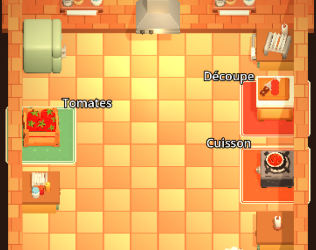
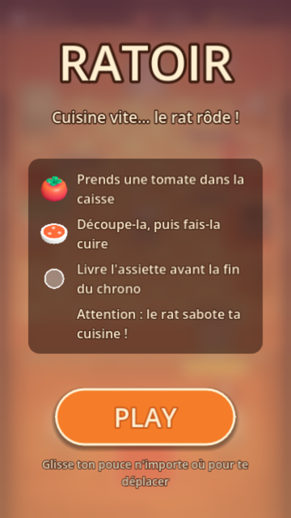
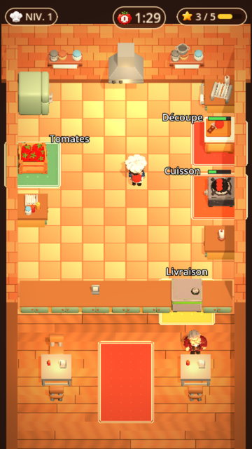
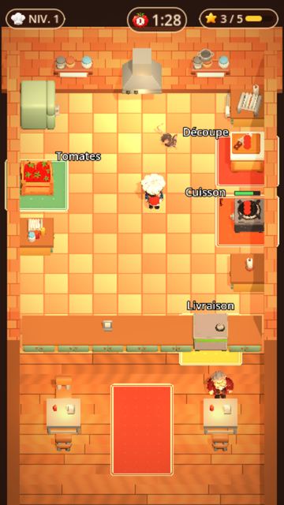
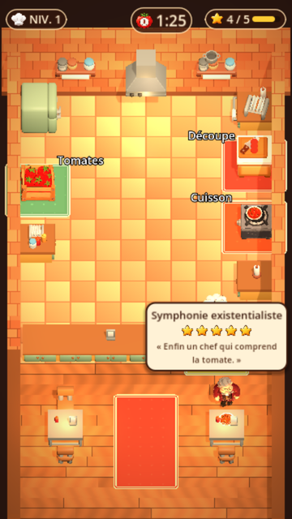
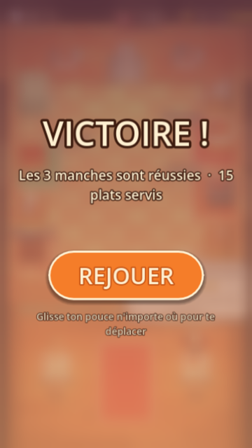

# Ratoir

<p align="center"></p>

> 🇫🇷 Cuisine vite, livre tes plats… pendant qu'un rat saboteur rôde dans ta cuisine !
> 🇬🇧 Cook fast, serve your dishes… while a sneaky rat wreaks havoc in your kitchen!

**[🇬🇧 English version below](#-english)**

<p align="center">
  
  
  
  
  
</p>

Jeu de cuisine en 3D pour **téléphone**, jouable **dans le navigateur** (export HTML5, hébergé sur itch.io). Projet de hackathon réalisé avec **Godot 4.7**.

---

## Sommaire

- [Le jeu](#le-jeu)
- [Contrôles](#contrôles)
- [État d'avancement](#état-davancement)
- [Démarrer (développeurs)](#démarrer-développeurs)
- [Tests](#tests)
- [Tester sur téléphone](#tester-sur-téléphone)
- [Publier sur itch.io](#publier-sur-itchio)
- [Structure du dépôt](#structure-du-dépôt)
- [Documentation](#documentation)
- [🇬🇧 English](#-english)

---

## Le jeu

Tu es le chef. Ta mission : servir un maximum d'assiettes avant la fin du chrono. Mais un rat sort de son trou pour semer le chaos dans ta cuisine…

- **La recette** : prendre une tomate dans la caisse → la **découper** sur la planche → la **cuire** sur la cuisinière → la **livrer** au comptoir de service. Tout se fait **au contact** : il suffit de marcher jusqu'au meuble.
- **Le rat** : il éteint la plaque (on la rallume au contact), vole les ingrédients et renverse les plats. Le chef ne peut pas le taper (choix actuel) : il faut l'éviter et réparer ses dégâts. En manche 3, quand le rat court plus vite que le chef, un **bac à pièges** apparaît : on prend un piège et on le pose (bouton **POSER** ou <kbd>E</kbd>).
- **Le juge** : attablé dans la salle, un critique gastronomique reçoit chaque plat livré (l'assiette va jusqu'à sa table), lui donne un **nom absurde**, une **note sur 5 étoiles** et un avis sans pitié, tirés d'une banque locale. La note dépend de la rapidité du service et des sabotages du rat. Le jeu ne se met jamais en pause pour lui.
- **Le critique** : une voix (en anglais), affamée et impatiente, commente toutes les quelques secondes l'action que tu fais le plus. Les phrases sont enregistrées dans le jeu : aucun réseau nécessaire.
- **3 manches** : objectif de 5, 10 puis 15 plats cumulés, en 90, 75 puis 60 s. La recette accélère et le rat court plus vite à chaque manche (4 m/s, 5,6 m/s puis 7,2 m/s ; le chef reste à 6 m/s). Pas de vies : si le chrono tombe à 0 avant l'objectif, la partie est perdue. Réussir la 3ᵉ manche gagne la partie.
- **Écrans** : **PLAY** au départ (la partie reste en pause tant qu'on n'a pas touché l'écran), puis **VICTOIRE !** ou **PARTIE TERMINÉE**, et **REJOUER**.
- **Ambiance** : cuisine chaleureuse façon *Overcooked* et salle du restaurant, vue en plongée en portrait. Musique : une minute de morceau par manche, de plus en plus intense, bouclée tant que le chrono dure ; elle démarre après **PLAY** (le navigateur exige un geste de l'utilisateur).

## Contrôles

| Action | Téléphone | Ordinateur |
|--------|-----------|------------|
| Se déplacer | Poser le pouce **n'importe où** et glisser (joystick flottant) | Clic-glisser, ou <kbd>Z</kbd><kbd>Q</kbd><kbd>S</kbd><kbd>D</kbd> / <kbd>W</kbd><kbd>A</kbd><kbd>S</kbd><kbd>D</kbd> / flèches |
| Ramasser, poser, livrer | **Automatique au contact** du meuble | idem |
| Poser un piège | Bouton **POSER** (manche 3, visible quand le chef tient un piège) | <kbd>E</kbd> |
| Taper le rat | *Désactivé* (voir [CONCEPT §8.3](docs/CONCEPT.md)) ; la parade jouable est le piège | — |
| Lancer / relancer | Bouton **PLAY** / **REJOUER** | Clic, ou <kbd>Entrée</kbd> |

## État d'avancement

| Phase | Contenu | État |
|------:|---------|------|
| 1 | Squelette : scène 3D, caméra, joueur, joystick tactile, export Web | ✅ Terminé |
| 2 | Boucle de cuisine complète + passage en portrait | ✅ Terminé |
| 3 | Le rat et ses sabotages (coup pour le taper désactivé) | ✅ Terminé |
| 4 | Partie en 3 manches, pièges, écran d'accueil, écrans de victoire et de défaite | ✅ Terminé |
| 5 | Critique vocal : 9 phrases enregistrées (MP3) | ✅ Terminé (voix en anglais) |
| 6 | Juge de plats ✅ · critiques générées par IA en direct, personnalité du rat, récap' final | 🟡 En partie |
| 7 | Chef, rat, juge, meubles et décor en 3D, cuisine refaite, HUD, musique | 🟡 En partie (plantes, bougies, trou du rat 3D à venir) |
| 8 | Build itch.io prêt, captures ; tests sur téléphones et démo à faire | 🟡 En partie |
| 9 | Recettes à plusieurs ingrédients, plan de dressage, commandes | 💡 Plus tard |

Chaque phase a sa fiche détaillée dans [`docs/phases/`](docs/phases/README.md).

## Démarrer (développeurs)

1. **Installer Godot 4.7.x « Standard »** (pas la version .NET) : <https://godotengine.org/download>.
2. **Cloner** le dépôt :
   ```bash
   git clone git@github.com:RayaneChCh-dev/Ratoir.git
   cd Ratoir
   ```
3. **Ouvrir** Godot → *Importer* → choisir `project.godot`. Le premier import régénère le dossier `.godot/` (ignoré par git, c'est normal).
4. **Lancer** avec <kbd>F5</kbd>. La scène principale est `scenes/main.tscn`.

> 💡 Sur ordinateur, la souris simule le doigt (`emulate_touch_from_mouse`) : clique-glisse n'importe où pour faire apparaître le joystick.

Avant de coder, lis [`docs/CONTRIBUTING.md`](docs/CONTRIBUTING.md) (branches, PR vers `staging`, règles pour les scènes Godot) et [`docs/ARCHITECTURE.md`](docs/ARCHITECTURE.md).

## Tests

```bash
godot --headless --path . res://tests/cooking_loop.tscn       # boucle de cuisine + collisions
godot --headless --path . res://tests/phase4_integration.tscn # manches, rat, fin de partie
godot --headless --path . res://tests/full_game.tscn          # partie complète jouée au joystick par un joueur automatique
```
Chaque test affiche `… : 0 échec(s)` quand tout va bien. Les avertissements de fuite mémoire affichés **à la fermeture** sont sans conséquence.

## Tester sur téléphone

Godot Web exige une page servie en **HTTPS** (ou `localhost`). Pour tester sur ton téléphone depuis ton PC :

```bash
./tools/export_web.sh            # exporte dans build/web/ (+ build/ratoir-web.zip)
python3 tools/serve_https.py     # affiche l'adresse à ouvrir, ex. https://192.168.1.20:8765
```

Sur le téléphone (même Wi-Fi que le PC) : ouvrir l'adresse affichée → avertissement « connexion non privée » (certificat auto-signé, normal) → *Paramètres avancés* → *Continuer vers le site*.

**Prérequis de l'export** : les *export templates* Godot 4.7.x pour le Web (*Éditeur → Gérer les modèles d'exportation → Télécharger et installer*).

## Publier sur itch.io

1. `./tools/export_web.sh` → produit `build/ratoir-web.zip` (`index.html` à la racine du zip).
2. Sur itch.io : **Kind of project : HTML** → envoyer le zip → cocher **« This file will be played in the browser »**.
3. *Embed options* : **360 × 640**, **Mobile friendly** en **Portrait**, **Fullscreen button**. Laisser *SharedArrayBuffer* décoché (export sans threads).
4. Captures et couverture : `docs/images/screens/` (versions réduites) ou `build/itch/` en pleine taille après une session de captures.

Détails et checklist de démo : [`docs/phases/PHASE-8-demo.md`](docs/phases/PHASE-8-demo.md).

## Structure du dépôt

```
Ratoir/
├── project.godot              # portrait 720×1280, rendu Compatibility, autoloads GameState et Commentator
├── export_presets.cfg         # preset « Web » (sans threads ; build/, tests/, art/ exclus)
├── scenes/
│   ├── main.tscn              # la cuisine, la salle, les personnages, l'interface
│   ├── player.tscn            # le chef
│   ├── rat.tscn               # le rat (logique) ; models/rat_model.tscn = son visuel
│   ├── judge.tscn             # le juge et sa bulle de critique
│   ├── chop_station.tscn, cook_station.tscn, ingredient_spawn.tscn, delivery_counter.tscn
│   ├── trap_bin.tscn, rat_trap.tscn, place_button.tscn, floor_item.tscn
│   └── ui/                    # onboarding.tscn (PLAY / REJOUER / VICTOIRE), game_hud.tscn
├── scripts/
│   ├── game_state.gd          # autoload : manches, chrono, score, journal d'événements
│   ├── ai/commentator.gd      # autoload : critique vocal (MP3)
│   ├── player.gd, cook.gd, item.gd, station.gd, camera_follow.gd, touch_joystick.gd …
│   ├── rat/                   # rat, profils, sabotages
│   ├── judge/                 # juge, bulle de critique
│   └── ui/                    # écran d'accueil, HUD, icônes
├── data/                      # judge_bank.json (textes du juge), rat_profiles/
├── assets/
│   ├── models/                # chef, rat, juge, meubles, assiette (Meshy, allégés)
│   ├── kaykit/                # décor KayKit Restaurant Bits (CC0)
│   ├── audio/                 # musique + critic/ (9 phrases du critique)
│   └── ui/icons/              # toque, chrono, étoile, aliments
├── shaders/                   # carrelage sol et murs, parquet, tapis, flou, vignettage
├── tests/                     # cooking_loop, phase4_integration, full_game
├── tools/
│   ├── export_web.sh          # export HTML5 + zip itch.io
│   ├── optimize_glb.py        # allège un .glb (textures, animations fusionnées) sans Blender
│   └── serve_https.py         # serveur HTTPS local pour tester sur téléphone
├── server/speak.py            # ancien proxy de voix Gradium (plus utilisé par le jeu)
└── docs/                      # concept, architecture, assets, contribution, phases, captures
```

## Documentation

| Document | Pour qui | Contenu |
|----------|----------|---------|
| [CONCEPT.md](docs/CONCEPT.md) | Toute l'équipe, le jury | Vision, règles, rat, sabotages, IA, direction artistique |
| [ARCHITECTURE.md](docs/ARCHITECTURE.md) | Développeurs | Scènes, scripts, autoloads, événements, conventions |
| [ASSETS.md](docs/ASSETS.md) | Artiste / intégrateur | Générer et intégrer les modèles 3D, prompts, icônes |
| [CONTRIBUTING.md](docs/CONTRIBUTING.md) | Toute l'équipe | Branches, PR, conflits de scènes, tests |
| [phases/](docs/phases/README.md) | Toute l'équipe | Feuille de route et répartition du travail |
| [CREDITS.md](CREDITS.md) | Tout le monde | Auteurs et licences des assets |

---

## 🇬🇧 English

**Ratoir** is a 3D cooking game for **mobile phones**, playable **right in the browser** (HTML5 export, hosted on itch.io). Built during a hackathon with **Godot 4.7**.

You are the chef. Your mission: serve as many dishes as possible before time runs out. But a rat crawls out of its hole to wreak havoc in your kitchen…

### How to play
- **The recipe**: grab a tomato from the crate → **chop** it on the cutting board → **cook** it on the stove → **serve** it at the service counter. Everything happens **on contact**: just walk up to the station.
- **The rat**: it turns off your stove (walk up to it to relight it), steals your ingredients and knocks over your dishes. The chef can't hit it (current design choice): dodge it and fix the damage. In round 3, once the rat runs faster than the chef, a **trap bin** appears: grab a trap and place it (**POSER** button or <kbd>E</kbd>).
- **The judge**: sitting in the dining room, a snobbish food critic tastes every dish you serve, gives it an **absurd name**, a **5-star rating** and a merciless review. The rating depends on how fast you served and on the rat's sabotage.
- **The commentator**: a hungry, impatient voice comments every few seconds on what you do the most. The lines are recorded inside the game: no network needed.
- **3 rounds**: reach 5, 10 then 15 total dishes in 90, 75 then 60 seconds. The recipe gets faster and the rat gets quicker every round (4 m/s, 5.6 m/s then 7.2 m/s; the chef stays at 6 m/s). No lives: if the timer hits 0 before the goal, you lose. Clear round 3 to win.
- **Mood**: a cozy *Overcooked*-style kitchen, top-down portrait view, and music that ramps up every round.

### Controls
| Action | Phone | Computer |
|--------|-------|----------|
| Move | Put your thumb **anywhere** and drag (floating joystick) | Click and drag, or <kbd>W</kbd><kbd>A</kbd><kbd>S</kbd><kbd>D</kbd> / <kbd>Z</kbd><kbd>Q</kbd><kbd>S</kbd><kbd>D</kbd> / arrow keys |
| Pick up, drop, serve | **Automatic on contact** with the station | same |
| Place a trap | **POSER** button (round 3, shown while holding a trap) | <kbd>E</kbd> |
| Start / restart | **PLAY** / **REJOUER** button | Click, or <kbd>Enter</kbd> |

📱 Designed for portrait mode on phones. Turn the sound on to hear the commentator!

### Run it locally
1. Install **Godot 4.7.x Standard** (not .NET): <https://godotengine.org/download>
2. `git clone git@github.com:RayaneChCh-dev/Ratoir.git`, then import `project.godot` in Godot and press <kbd>F5</kbd>.
3. Web build and phone testing: `./tools/export_web.sh` then `python3 tools/serve_https.py` (open the printed `https://` address on your phone, same Wi-Fi, accept the self-signed certificate).
4. Tests: `godot --headless --path . res://tests/full_game.tscn` (plus `cooking_loop` and `phase4_integration`).

The detailed design and team documentation (in French) lives in [`docs/`](docs/).

### Credits
Built by the Ratoir team during a hackathon with Godot Engine. Environment: KayKit Restaurant Bits by Kay Lousberg (CC0). Characters and furniture generated with Meshy AI. Commentator voice: Gradium. See [CREDITS.md](CREDITS.md).
