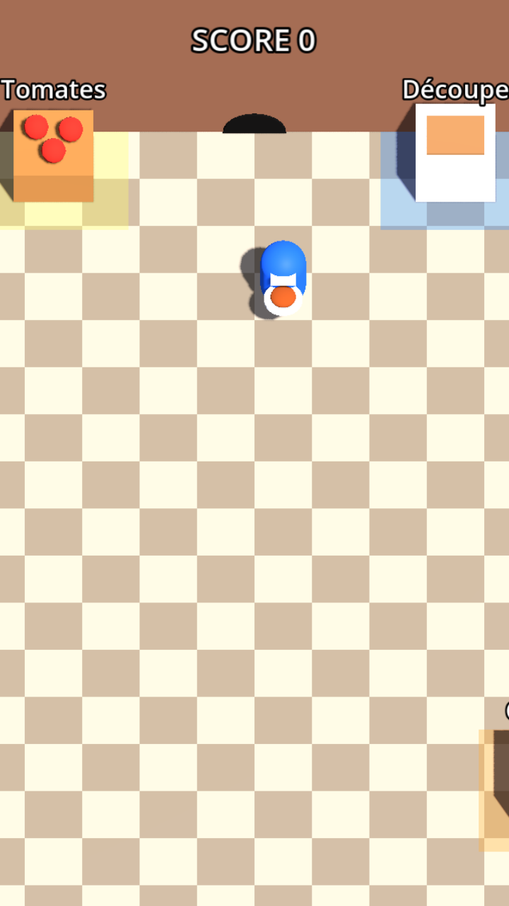

# Ratoir

> Un jeu de cuisine mobile en 3D où tu dois servir un maximum de plats avant la fin du temps… pendant qu'un rat sort de son trou pour tout saboter.

<p align="center"></p>

Projet de hackathon réalisé avec **Godot 4.7** et exporté pour le **navigateur mobile** (HTML5, hébergé sur itch.io).
Un critique affamé commente la partie à voix haute (voix Gradium). Le juge IA et le rat arrivent ensuite (voir [le concept complet](docs/CONCEPT.md)).

---

## Sommaire

- [Le jeu en 30 secondes](#le-jeu-en-30-secondes)
- [État d'avancement](#état-davancement)
- [Démarrer (développeurs)](#démarrer-développeurs)
- [Entendre le critique](#entendre-le-critique)
- [Contrôles](#contrôles)
- [Tester sur téléphone](#tester-sur-téléphone)
- [Publier sur itch.io](#publier-sur-itchio)
- [Structure du dépôt](#structure-du-dépôt)
- [Documentation](#documentation)

---

## Le jeu en 30 secondes

- **Format** : portrait, plein écran, sur téléphone (dans le navigateur).
- **Vue** : 3D en plongée façon *Overcooked*. La caméra ne tourne jamais ; elle suit le joueur en glissant quand il s'éloigne du centre de l'écran.
- **Boucle** : prendre une tomate au bac → la **découper** → la **cuire** → la **livrer** au comptoir → **+1 point**.
- **L'ennemi** : un **rat** sort d'un trou dans le mur pour saboter (éteindre la plaque, renverser le plat, voler un ingrédient…). Pour l'instant, le chef ne peut rien contre lui : il faut l'éviter et réparer ses dégâts.
- **Progression** : une partie dure 3 manches, à 5, 10 puis 15 plats cumulés. Le chrono passe de 90 s à 75 s puis 60 s, la recette accélère un peu, et le rat court plus vite. Pas de vies : si le chrono arrive à 0 avant l'objectif, la partie se termine. La 3e manche réussie gagne la partie. Un plat renversé est perdu, sans autre pénalité.
- **Musique** : le morceau monte d'intensité à chaque manche — une minute de soundtrack par manche, bouclée tant que le chrono de la manche dure.
- **Étoiles** : le score cumulé donne des étoiles :

| Étoiles | Points nécessaires |
|:-------:|:------------------:|
| ★       | 5                  |
| ★★      | 10                 |
| ★★★     | 15                 |

- **Le critique** : une voix anglaise, affamée et impatiente. Toutes les quelques secondes, elle commente l'action que tu as faite le plus (prendre une tomate, découper, cuire, livrer). Le jeu n'attend jamais la voix. Le juge de plats et le récap' de fin ne sont pas encore là.

## État d'avancement

| Phase | Contenu | État |
|------:|---------|------|
| 1 | Squelette : scène 3D, caméra, joueur, joystick tactile, export Web | ✅ Terminé |
| 2 | Boucle de cuisine complète (ramasser, découper, cuire, livrer, score) + passage en portrait | ✅ Terminé |
| 3 | Le rat et ses sabotages (le coup pour le taper est désactivé pour l'instant) | ✅ Terminé |
| 4 | Manche complète : partie à 3 manches jouable ; écran titre et écran de fin illustré à faire | ⏳ En cours |
| 5 | Critique vocal : phrase selon l'action dominante + voix Gradium | ✅ Démo jouable |
| 6 | Juge de plats + personnalité du rat + récap' final IA | ⏳ À faire |
| 7 | Polish : vrais modèles 3D, animations, sons, effets | ⏳ À faire |
| 8 | Déploiement itch.io, tests sur téléphones, script et répétition de la démo | ⏳ À faire |
| 9 | Recettes à plusieurs ingrédients, plan de dressage, commandes | 💡 Plus tard |

Chaque phase restante a sa fiche détaillée dans [`docs/phases/`](docs/phases/README.md), avec la répartition possible entre coéquipiers.

## Démarrer (développeurs)

1. **Installer Godot 4.7.x « Standard »** (pas la version .NET) : <https://godotengine.org/download>.
2. **Cloner** le dépôt :
   ```bash
   git clone git@github.com:RayaneChCh-dev/Ratoir.git
   cd Ratoir
   ```
3. **Ouvrir** Godot → *Importer* → choisir `project.godot`. Le premier import régénère le dossier `.godot/` (ignoré par git, c'est normal).
4. **Lancer** avec <kbd>F5</kbd>. La scène principale est `scenes/main.tscn`.

> 💡 Sur ordinateur, la souris simule le doigt (`emulate_touch_from_mouse`) : clique-glisse n'importe où pour faire apparaître le joystick. Le clavier marche aussi.

Avant de coder, lis [`docs/CONTRIBUTING.md`](docs/CONTRIBUTING.md) (règles pour ne pas se marcher dessus dans les scènes Godot) et [`docs/ARCHITECTURE.md`](docs/ARCHITECTURE.md).

## Entendre le critique

Les neuf phrases sont déjà enregistrées dans `assets/audio/critic/` (voix Mark). Le jeu les joue tout seul : pas besoin de lancer le proxy ni d'une clé Gradium.

```bash
godot --path .
```

Après environ deux secondes, la voix dit « I'm hungry. The chef had better hurry. » Il n'y a pas de sous-titre. Ensuite, joue : la phrase suivante suit l'action la plus fréquente sur environ 4 secondes.

## Contrôles

| Action | Téléphone | Ordinateur |
|--------|-----------|------------|
| Se déplacer | Poser le pouce **n'importe où** et glisser (joystick flottant) | Clic-glisser, ou <kbd>Z</kbd><kbd>Q</kbd><kbd>S</kbd><kbd>D</kbd> / <kbd>W</kbd><kbd>A</kbd><kbd>S</kbd><kbd>D</kbd> / flèches |
| Ramasser, poser, livrer | **Automatique au contact** : il suffit de marcher jusqu'au tapis coloré devant un meuble | idem |
| Taper le rat | *Désactivé pour l'instant* (voir CONCEPT §8.3) | — |

## Tester sur téléphone

Godot Web exige une page servie en **HTTPS** (ou `localhost`). Pour tester sur ton téléphone depuis ton PC :

```bash
./tools/export_web.sh            # exporte dans build/web/ (+ build/ratoir-web.zip)
python3 tools/serve_https.py     # affiche l'adresse à ouvrir, ex. https://192.168.1.20:8765
```

Sur le téléphone (même Wi-Fi que le PC) : ouvrir l'adresse affichée → avertissement « connexion non privée » (certificat auto-signé, normal) → *Paramètres avancés* → *Continuer vers le site*.

**Prérequis de l'export** : les *export templates* Godot 4.7.x pour le Web. Dans l'éditeur : *Éditeur → Gérer les modèles d'exportation → Télécharger et installer*.

## Publier sur itch.io

1. `./tools/export_web.sh` → produit `build/ratoir-web.zip` (`index.html` à la racine du zip, c'est ce qu'itch.io attend).
2. Sur itch.io : *Create new project* → **Kind of project : HTML** → envoyer le zip → cocher **« This file will be played in the browser »**.
3. Dans *Embed options* : cocher **Mobile friendly**, orientation **Portrait**, et **Fullscreen button**.
4. Taille de la fenêtre intégrée conseillée : 360 × 640 (ratio 9:16).
5. Pas besoin de cocher *SharedArrayBuffer support* : l'export est configuré **sans threads** exprès.

Détails et checklist de démo : [`docs/phases/PHASE-8-demo.md`](docs/phases/PHASE-8-demo.md).

## Structure du dépôt

```
Ratoir/
├── project.godot            # configuration Godot (portrait 720×1280, rendu Compatibility, autoloads GameState et Commentator)
├── export_presets.cfg       # preset d'export « Web » (sans threads)
├── scenes/
│   ├── main.tscn            # la cuisine : sol, murs, trou du rat, stations, joueur, caméra, UI
│   ├── player.tscn          # le cuisinier (CharacterBody3D)
│   ├── chop_station.tscn    # station Découpe
│   ├── cook_station.tscn    # station Cuisson
│   ├── ingredient_spawn.tscn# bac à tomates
│   └── delivery_counter.tscn# comptoir de livraison
├── scripts/
│   ├── game_state.gd        # autoload : score, étoiles, journal d'événements
│   ├── ai/commentator.gd    # autoload : critique vocal (fenêtre d'actions, voix seule)
│   ├── cook.gd              # base du cuisinier : objet tenu en main
│   ├── player.gd            # déplacement du joueur (joystick + clavier)
│   ├── touch_joystick.gd    # joystick tactile flottant plein écran
│   ├── camera_follow.gd     # caméra en plongée qui suit le joueur, bornée à la cuisine
│   ├── item.gd              # ingrédient : brut → découpé → cuit
│   ├── station.gd           # Découpe / Cuisson (transformation temporisée)
│   ├── ingredient_spawn.gd  # donne une tomate au contact
│   ├── delivery_counter.gd  # livre un plat cuit → +1 point
│   ├── progress_bar_3d.gd   # barre de progression au-dessus des stations
│   └── hud.gd               # affichage du score
├── shaders/checker_floor.gdshader  # carrelage du sol
├── server/
│   ├── speak.py             # ancien proxy Gradium, plus utilisé par le jeu
│   └── .env.example         # GRADIUM_API_KEY, sans valeur (le vrai .env est ignoré)
├── assets/audio/critic/     # neuf phrases du critique, déjà enregistrées
├── assets/models/           # modèles 3D (.glb) : characters/chef.glb…
├── tools/
│   ├── export_web.sh        # export HTML5 + zip itch.io
│   ├── optimize_glb.py      # allège un .glb (textures, animations fusionnées) sans Blender
│   └── serve_https.py       # serveur HTTPS local pour tester sur téléphone
└── docs/
    ├── CONCEPT.md           # le concept complet du jeu (document de référence)
    ├── ARCHITECTURE.md      # comment le code est organisé, contrats entre modules
    ├── ASSETS.md            # trouver / générer / intégrer de meilleurs modèles 3D
    ├── CONTRIBUTING.md      # règles de travail en équipe (git + Godot)
    └── phases/              # une fiche détaillée par phase
```

## Documentation

| Document | Pour qui | Contenu |
|----------|----------|---------|
| [CONCEPT.md](docs/CONCEPT.md) | Toute l'équipe, le jury | Vision, règles, rat, sabotages, IA, direction artistique |
| [ARCHITECTURE.md](docs/ARCHITECTURE.md) | Développeurs | Scènes, scripts, autoloads, événements, conventions |
| [ASSETS.md](docs/ASSETS.md) | Artiste / intégrateur | Où trouver ou comment générer les modèles 3D, format, import |
| [CONTRIBUTING.md](docs/CONTRIBUTING.md) | Toute l'équipe | Branches, commits, conflits de scènes, tests |
| [phases/](docs/phases/README.md) | Toute l'équipe | Feuille de route et répartition du travail |
