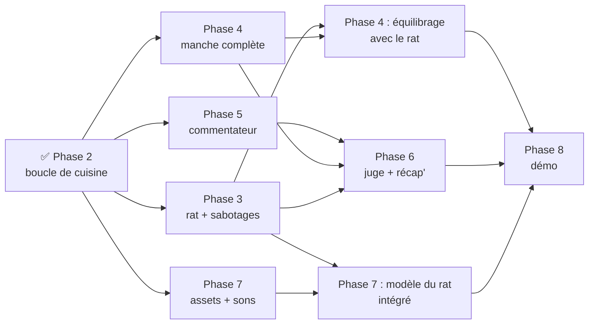

# Feuille de route et répartition du travail

## Où en est-on ?

| Phase | Fiche | État | Profil conseillé | Estimation |
|------:|-------|------|------------------|-----------:|
| 1 | [Squelette](PHASE-1-squelette.md) | ✅ Terminé | — | — |
| 2 | [Boucle de cuisine + portrait](PHASE-2-boucle-cuisine.md) | ✅ Terminé | — | — |
| 3 | [Le rat et les sabotages](PHASE-3-rat.md) | ⏳ À faire | Dev gameplay (Godot) | 2 h 30 à 3 h |
| 4 | [Manche complète : titre, chrono, étoiles](PHASE-4-manche.md) | ⏳ À faire | Dev gameplay/UI (Godot) | 1 h 30 à 2 h |
| 5 | [Commentateur IA](PHASE-5-commentateur.md) | ⏳ À faire | Dev IA/backend (+ un peu de Godot) | 2 h 30 à 3 h |
| 6 | [Juge, personnalité du rat, récap' final](PHASE-6-juge-recap.md) | ⏳ À faire | Dev IA/backend | 1 h 30 à 2 h |
| 7 | [Polish : assets 3D, animations, sons, effets](PHASE-7-polish.md) | ⏳ À faire | Artiste/intégrateur | 2 h à 3 h (en continu) |
| 8 | [Déploiement et démo](PHASE-8-demo.md) | ⏳ À faire | Toute l'équipe | 1 h |
| 9 | [Recettes et assemblage](PHASE-9-recettes.md) | 💡 Plus tard (après 3 et 4) | Gameplay + Assets | 3 à 4 h |

Les estimations sont indicatives, pour une personne qui connaît déjà un peu Godot.

## Dépendances : qui attend qui ?

**Ce qui peut démarrer tout de suite, en parallèle :**
- **Phase 3** (rat) et **Phase 4** (titre, chrono, écran de fin) : elles touchent des fichiers différents. Seul l'**équilibrage** final de la Phase 4 a besoin du rat.
- **Phase 5** : la banque de répliques, le serveur relais (proxy) et l'autoload `Commentator` peuvent être développés **dès maintenant**, car ils ne dépendent que de `GameState.event_logged` (déjà en place) et de la liste d'événements de [ARCHITECTURE.md](../ARCHITECTURE.md#5-journal-dévénements). Pour tester avant que le rat existe, on peut simuler des événements (voir la fiche).
- **Phase 7** : la recherche et la préparation des modèles 3D et des sons (voir [ASSETS.md](../ASSETS.md)) ne dépendent de rien. L'intégration du chef et des meubles peut se faire dès maintenant ; celle du rat, après la Phase 3.

## Répartition conseillée

### Équipe de 4
| Personne | Travail | Ordre |
|----------|---------|-------|
| **A — Gameplay** | Phase 3 (rat + sabotages + TAPER) | 3 → aide à l'équilibrage de la 4 |
| **B — Gameplay/UI** | Phase 4 (titre, chrono, écran de fin, rejouer) | 4 → équilibrage avec A → Phase 8 |
| **C — IA** | Phase 5 puis Phase 6 | 5 (banque + proxy + commentateur) → 6 |
| **D — Art/Audio** | Phase 7 | Assets → chef/meubles → rat (après A) → sons → effets |
| **Tous** | Phase 8 | Dernière heure |

### Équipe de 3
- **A** : Phase 3, puis équilibrage.
- **B** : Phase 4, puis Phase 7 (intégration des assets choisis par tout le monde).
- **C** : Phases 5 et 6.

### Équipe de 2
- **A** : Phases 3 et 4 (gameplay complet).
- **B** : Phases 5 et 6 (IA), avec des assets **pris tels quels** dans un pack CC0 (Phase 7 minimale).

## Règles communes

- Lire [CONTRIBUTING.md](../CONTRIBUTING.md) avant de commencer (propriété des scènes, branches, `.uid`).
- **Ne jamais passer à la suite avec une boucle de cuisine cassée.** Si `main` ne se joue plus, on répare d'abord.
- **Chaque phase se termine par un test sur un vrai téléphone.**
- Cocher les cases des fiches au fur et à mesure (dans la PR) : ça sert de tableau de bord à l'équipe.
